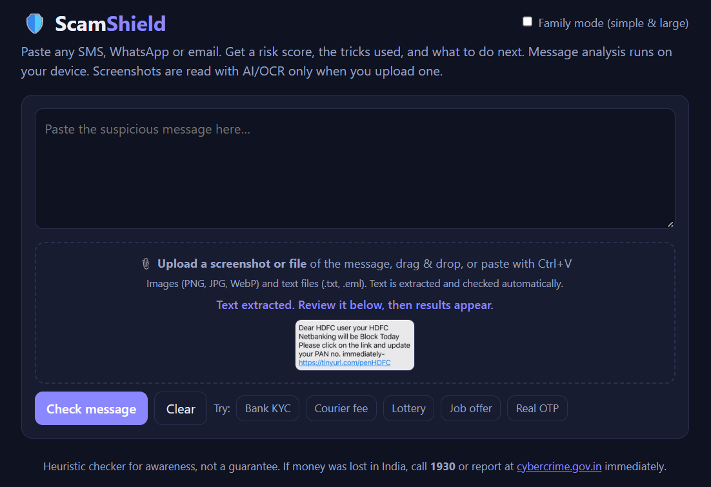
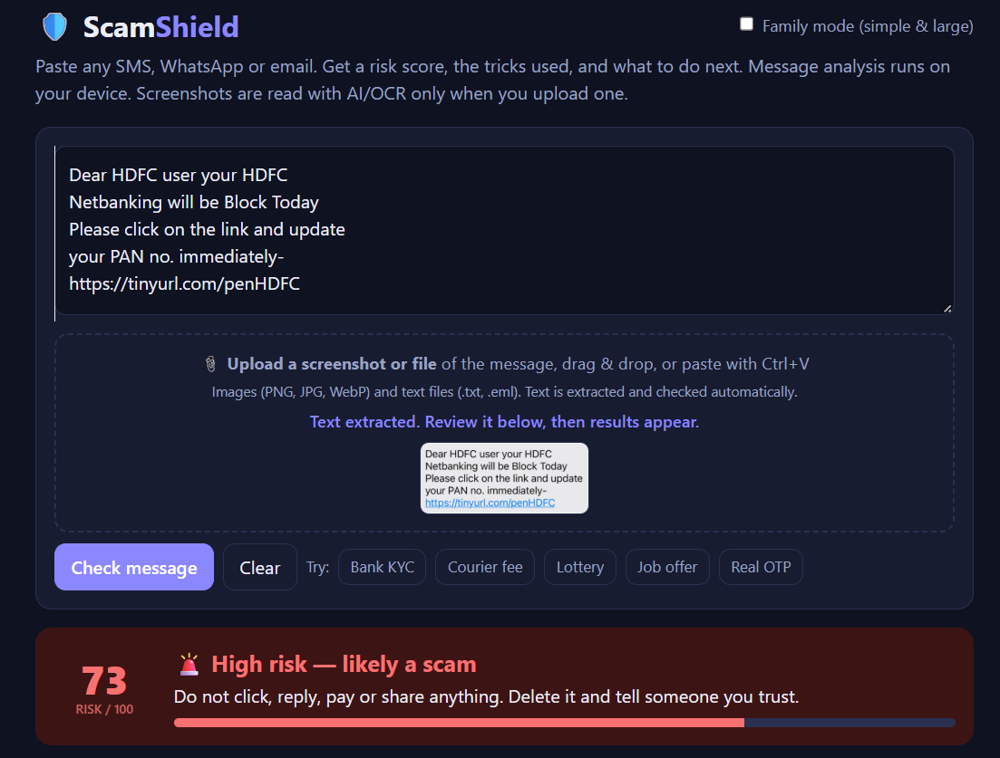
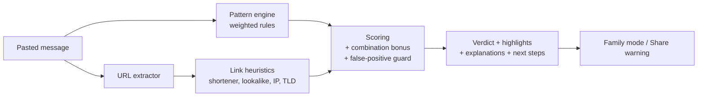

# 🛡️ ScamShield

**A privacy-first scam message checker for SMS, WhatsApp and email.**
Paste a suspicious message and get a risk score, the manipulation tactics highlighted, link analysis and clear next steps, all inside your browser.

> **Track:** Digital Safety & Cybersecurity

**🔗 Live Demo:** <your GitHub Pages / Netlify link>
**🎥 Demo Video:** <your Google Drive link>

## 📸 Screenshots




## ❗ The Problem

Fake KYC updates, courier "redelivery fees", lottery prizes, task-based job offers and "digital arrest" threats cost people in India crores every day. Elderly and first-time digital users are hit hardest, and most have no quick way to check a message before acting on it.

## 💡 The Solution

ScamShield turns scam awareness into a five-second habit.

| Feature | What it does |
|---|---|
| **Risk score (0-100)** | Clear verdict: Low risk, Suspicious or High risk |
| **Red-flag highlighting** | Marks phrases by tactic: urgency, money request, asking for secrets, impersonation, suspicious link, too-good-to-be-true bait |
| **Plain-language "why"** | Explains each flag so users learn to spot scams themselves |
| **Link analysis** | Detects URL shorteners, look-alike bank domains, raw IPs, punycode, risky domain endings and non-HTTPS links |
| **Next steps** | Tailored actions, including India's **1930** helpline and cybercrime.gov.in |
| **Family Mode** | Large, simple verdict for elderly relatives |
| **Share warning** | One tap copies a ready-made alert for the family WhatsApp group |
| **Recent checks** | Local history, stored only in your browser |
| **Privacy by design** | No server, no uploads, no tracking |

## ⚙️ How It Works



**Scoring logic**
1. Each rule has a weight (for example, asking for an OTP or PIN scores 30, urgency scores 14).
2. Every link is analysed, and each red flag in the address adds to the score.
3. Bonuses apply when several tactic types appear together, or when a link appears alongside a request for secrets.
4. A guard lowers the score for genuine bank alerts that say "never share your OTP" and have no payment request or bad link.
5. The final score is 0-100: **0-24 low risk, 25-54 suspicious, 55+ high risk.**

## 🛠️ Tech Stack

HTML5, CSS3 (light and dark themes) and vanilla JavaScript. No frameworks, no backend, no network requests.

## 🚀 Run Locally

```bash
git clone [https://github.com/<your-username>/scamshield.git](https://github.com/rahuldombe5-beep/scamshield-project/edit/main/README.md)
cd scamshield
# open index.html in your browser
```

## 🧪 Try It

Use the one-click samples in the app: **Bank KYC**, **Courier fee**, **Lottery**, **Job offer**, and a genuine **OTP** message that should score low.

## ⚠️ Limitations

ScamShield is a heuristic tool for awareness, not a guarantee. It can miss new scams and may occasionally flag a genuine message. Always verify through the official app or the number printed on your card or bill.

## 🗺️ Roadmap

- [ ] Optional LLM "second opinion" for new scams
- [ ] Hindi, Marathi and other Indian languages
- [ ] WhatsApp / Telegram bot
- [ ] Browser extension and Android share integration
- [ ] Screenshot (OCR) input
- [ ] Community-reported scam patterns

## 🆘 If You've Been Scammed (India)

Call **1930** immediately and report at [cybercrime.gov.in](https://cybercrime.gov.in). Contact your bank to block cards and UPI. Forward spam SMS to **1909**.

## 📄 License

MIT
